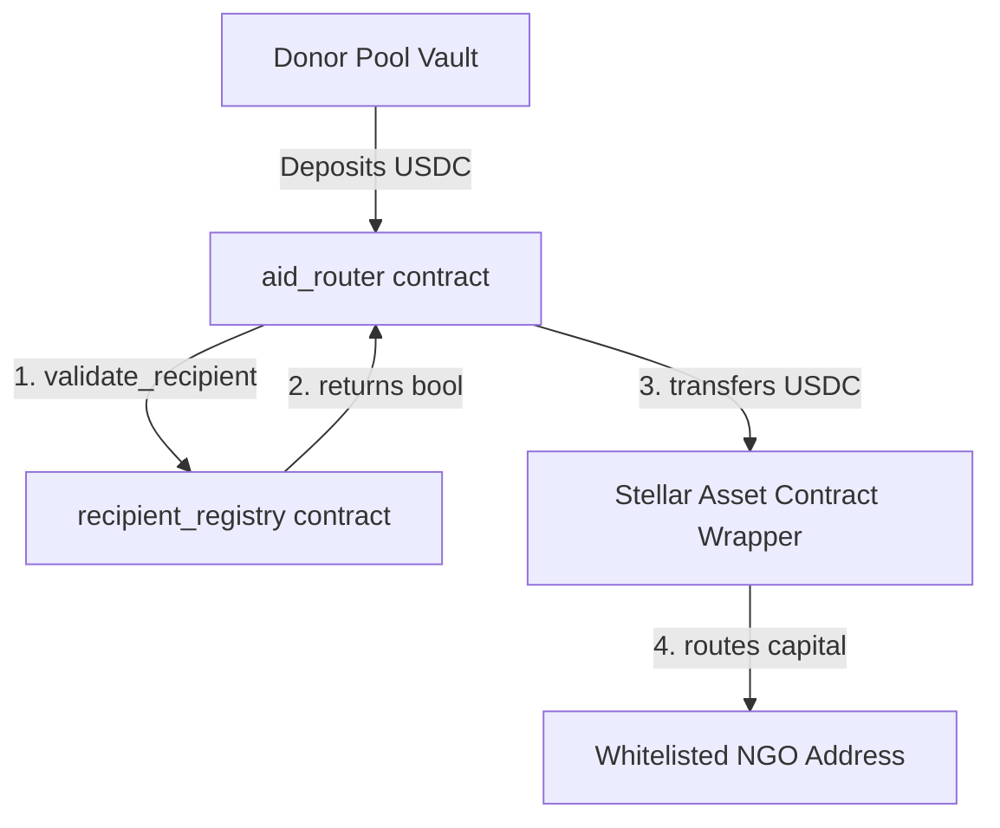
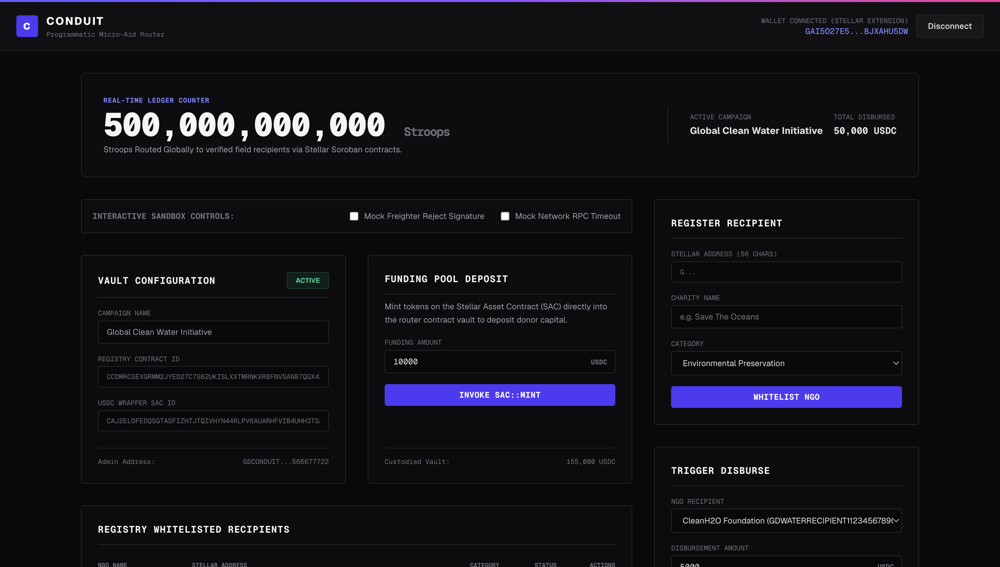
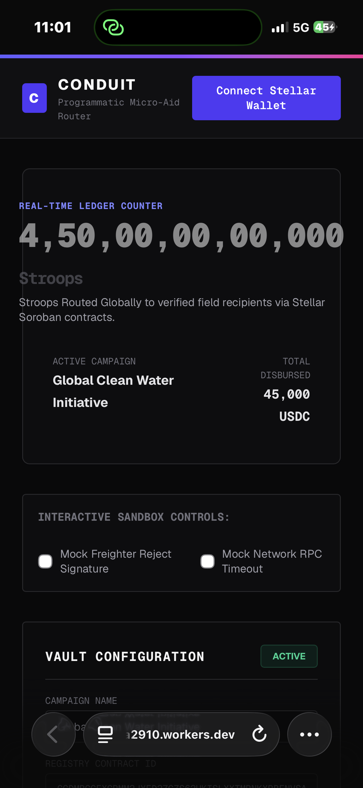
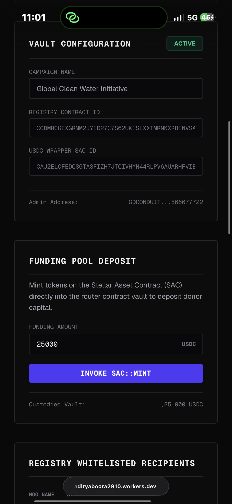
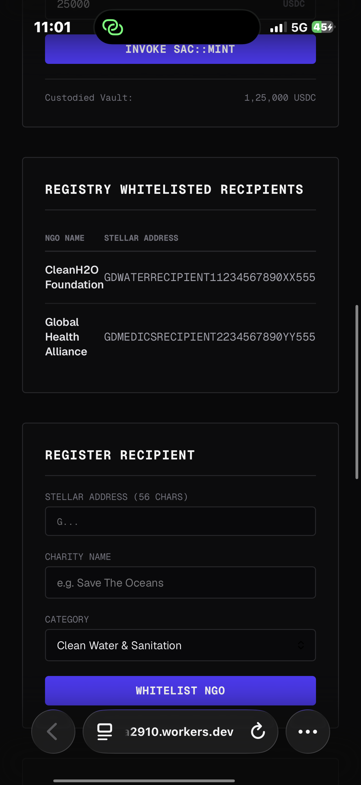

# Conduit: Programmatic Micro-Aid Router

Conduit is a production-grade programmatic micro-aid routing platform implemented on Stellar Soroban and Next.js 15. It utilizes dynamic, dual-contract architectures to custody donor pools and execute secure cross-contract NGO whitelist verification cycles.

[](https://stellarwallet.adityaboora2910.workers.dev/)

---

### 1. Project Overview & Production Architecture

Conduit's architecture segregates whitelisting administration from capital vault operations. It consists of two smart contracts:

- **Recipient Registry Contract**: Acts as a dynamic on-chain database for verified NGO addresses. Whitelisting updates require authorization signatures from the contract admin.
- **Aid Router Contract**: Custodies USDC donor pools. When disbursements are requested, it executes a real-time cross-contract lookup to the Recipient Registry to verify recipient verification status before triggering token transfers on the Stellar Asset Contract (SAC) wrapper.



---

### 2. Verified Testnet Contract Addresses

Below are the addresses of our live deployed contracts on the Stellar Testnet:

*   **Recipient Registry Contract ID**: 
    [`CCDMRCGEXGRMM2JYED27C7S62UKISLXXTMRNKXRBFNVSANB7QGX4ZVDV`](https://stellar.expert/explorer/testnet/contract/CCDMRCGEXGRMM2JYED27C7S62UKISLXXTMRNKXRBFNVSANB7QGX4ZVDV)
*   **Wrapped USDC Token Contract (SAC) ID**: 
    [`CAJ2ELOFEDQSGTASFIZH7JTQIVHYN44RLPV6AUARHFVIB4UHH3TSATLA`](https://stellar.expert/explorer/testnet/contract/CAJ2ELOFEDQSGTASFIZH7JTQIVHYN44RLPV6AUARHFVIB4UHH3TSATLA)
*   **Aid Router Contract ID**: 
    [`CB3QGYVQCZRSA7VJK2SVQZV7AYJTVETL5M6HASMZNSW62KNWQF4U764N`](https://stellar.expert/explorer/testnet/contract/CB3QGYVQCZRSA7VJK2SVQZV7AYJTVETL5M6HASMZNSW62KNWQF4U764N)

---

### 3. Verifiable Transaction Proofs

Here are the verifiable transaction hashes matching the setup operations on the Stellar Testnet ledger:

*   **Friendbot Developer Wallet Funding Hash**:
    [`f0e3b26a860fa347594fca3fdf52913493c80c7e1c5c31bbbab2a1e372812636`](https://stellar.expert/explorer/testnet/tx/f0e3b26a860fa347594fca3fdf52913493c80c7e1c5c31bbbab2a1e372812636)
*   **Recipient Registry Deployment Hash**:
    [`21fceecdaf841a020532582408131fced3d23a167707dd39a79e42417fafa76d`](https://stellar.expert/explorer/testnet/tx/21fceecdaf841a020532582408131fced3d23a167707dd39a79e42417fafa76d)
*   **Recipient Registry Initialization Hash**:
    [`81ea1b319be19e0ebab479b025d43237fd892f07af5fd2a8d36c33f7891bd2db`](https://stellar.expert/explorer/testnet/tx/81ea1b319be19e0ebab479b025d43237fd892f07af5fd2a8d36c33f7891bd2db)
*   **USDC Token SAC Wrapper Deployment Hash**:
    [`156c5d23604961b487e2f4a4e5a1d902c2b110e7c6e642a1a2150b5913783c7d`](https://stellar.expert/explorer/testnet/tx/156c5d23604961b487e2f4a4e5a1d902c2b110e7c6e642a1a2150b5913783c7d)
*   **Charity Recipient Whitelisting Hash**:
    [`05724ff7d3ec8c732df8ddf102ccd0e0c7b00f60b85570daaeead6ea4d5a6321`](https://stellar.expert/explorer/testnet/tx/05724ff7d3ec8c732df8ddf102ccd0e0c7b00f60b85570daaeead6ea4d5a6321)
*   **Aid Router Deployment Hash**:
    [`72b8297c0cd5871f2c89c6046a28615a8af159d927ab88d801924b6a78e06d8e`](https://stellar.expert/explorer/testnet/tx/72b8297c0cd5871f2c89c6046a28615a8af159d927ab88d801924b6a78e06d8e)
*   **Aid Router Initialization Hash**:
    [`dc2e94404ef9a814741faeb4e0dae898deab68cca6dfdd537825409af34b275d`](https://stellar.expert/explorer/testnet/tx/dc2e94404ef9a814741faeb4e0dae898deab68cca6dfdd537825409af34b275d)

---

### 4. Cross-Contract Invocation Mechanism

The cross-contract query loops inside the `aid_router` contract execute using the required `env.invoke_contract` method format:

```rust
// contracts/aid_router/src/lib.rs

let is_verified = env.invoke_contract::<bool>(
    &registry_contract_id,
    &Symbol::new(&env, "validate_recipient"),
    vec![&env, target_ngo],
);
```

---

### 5. Automated CI/CD Pipeline & Complete Test Results

The project is protected by a dual-job parallel GitHub Actions workflow checking Rust/Soroban contracts formatting, lints, and tests alongside Node.js Vitest tests and production bundle compilation.

#### Contract Cargo Test Output
```text
running 7 tests
test test::test_payout_fails_unverified ... ok
test test::test_reinitialization_fails ... ok
test test::test_non_admin_auth_fault - should panic ... ok
test test::test_initialization ... ok
test test::test_exceeds_available_balance ... ok
test test::test_payout_success ... ok
test test::test_inactive_campaign_fails ... ok

test result: ok. 7 passed; 0 failed; 0 ignored; 0 measured; 0 filtered out; finished in 0.08s

     Running unittests src/lib.rs (target/debug/deps/recipient_registry-9551508e7b44d38b)

running 2 tests
test test::test_registry_events ... ok
test test::test_registry_flow ... ok

test result: ok. 2 passed; 0 failed; 0 ignored; 0 measured; 0 filtered out; finished in 0.03s
```

#### Frontend Vitest Output
```text
 RUN  v4.1.10 /Users/adityaboora/project-2 new/frontend

 ✓ src/tests/integration.test.ts (3 tests) 3ms
 ✓ src/tests/utils.test.ts (6 tests) 4ms

 Test Files  2 passed (2)
      Tests  9 passed (9)
   Start at  11:31:45
   Duration  208ms (transform 71ms, setup 0ms, import 96ms, tests 6ms, environment 0ms)
```


---

### 6. Mobile Responsive Layout & Production UI Validation

The Next.js 15 control center features full layout responsive breakpoints.

#### Desktop Control Center & Live Demo



#### Mobile Control Center Layouts
<p align="center">
  
  
  
</p>

---

### 🚀 Production Hosting URL
- **Production Server Link**: [https://stellarwallet.adityaboora2910.workers.dev/](https://stellarwallet.adityaboora2910.workers.dev/)
